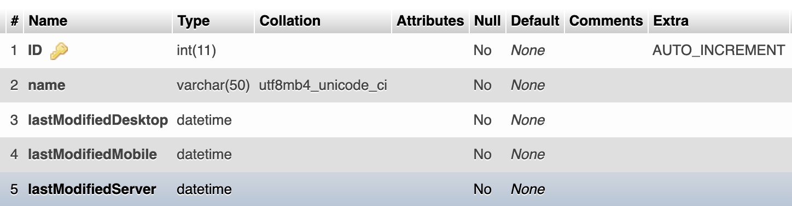
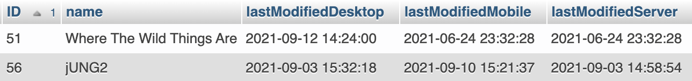

# Visualization Mail (V-Mail)
V-Mail is  a framework of cross-platform applications, interactive techniques, and communication protocols for improved multi-person correspondence about spatial 3D datasets. Please check our paper: <em>V-Mail: 3D-Enabled Correspondence about Spatial Data on (Almost) All Your Devices  (https://doi.org/10.1109/TVCG.2022.3229017).</em>

## Related GitHub Repos
* PC/Mac, Android V-Mail Clients
    * https://github.com/JungWhoNam/VisualizationMail
* V-Mail Server (this current repo)
    * https://github.com/JungWhoNam/VisualizationMailServer
<!-- * Integration to a data visualization application
    * https://github.com/JungWhoNam/BrainTensorVis/tree/vmail -->

# Visualization Mail (V-Mail) Server
The server is composed of a MySQL Database and a file storage. PHP scripts in this repo handles server-side scripting. 

## Run the server application
The easiest way to run this application is using [the docker image](https://github.com/mattrayner/docker-lamp), which provides resources for running LAMP (Linux, Apache, MySQL, and PHP) applications. This project is already structured to work with the docker container.
* PHP files are placed under `app`.
* `mysql/` folder is there to make the SQL persistent.
* `run` starts the server using the docker image.

Steps to run this application:
1. Install [docker](https://www.docker.com/get-started/)
2. Clone this repo
3. Run the script `run`
4. Create `vmails` database and `vmails` table (see the next section)
5. *(Optional)* Specify your db configurations in `app/ConnectionSettings.php`

> `app/phpinfo.php` is provided for a simple test. Type `http://localhost/phpinfo.php` in your browser to see if the server is working.

## MySQL Specifications
The table is composed of five fields, and `ID` is an auto-increment primary key field in the db.


Here are example entires.


Or use ``app/create_vmails_table.sql``, a SQL dump file, to create the table.

```
# create `vmails` table in `vmails` database
mysql vmails < /app/create_vmails_table.sql
```